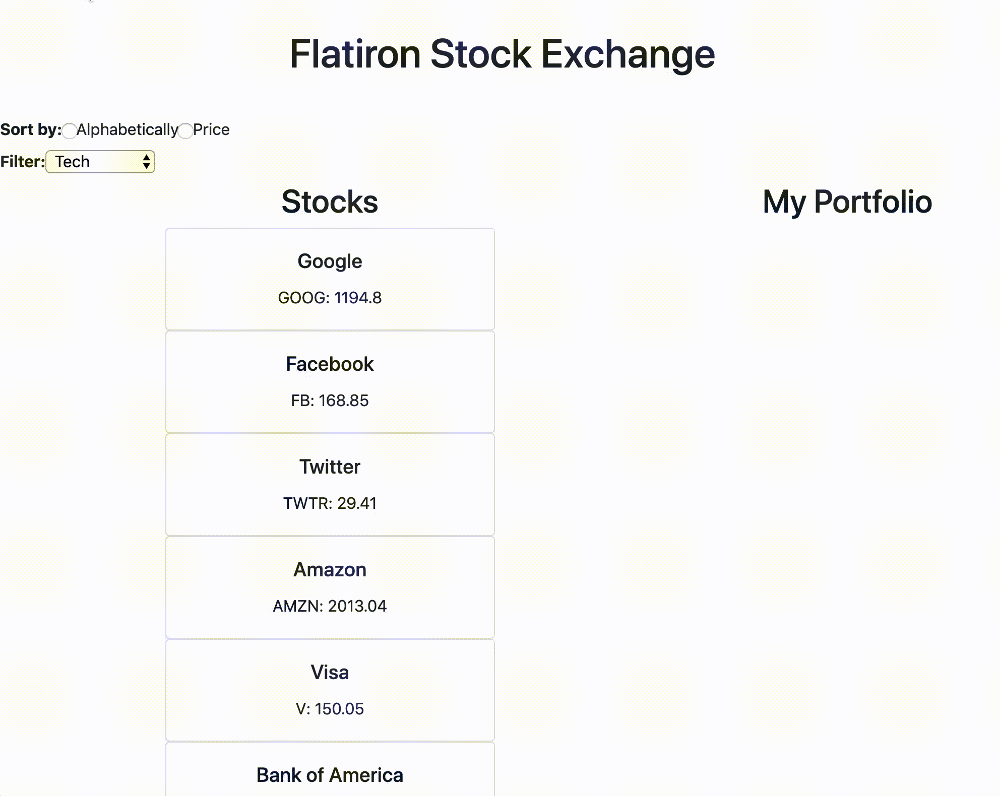

## Flatiron Stock Exchange



Welcome to the Flatiron Stock Exchange!
Today, you are a broker who is trying to better organize the stocks available on the Flatiron Stock Market.
The database of stocks can be found in a JSON-server, so before you start your React server, make sure to start your JSON-server on `http://localhost:3000/stocks`.

```
TO INSTALL: npm install -g json-server
TO START: json-server --watch db.json
```

After the stocks are fetched, your job is to:
* Render all the stocks onto the page. The styling of how a Stock should look like is already in the `Stock.js` component.
  - fetch
  - component did mount
  - probably requires state?
  - an array stocks iterate and return Stock components

* allow a user to buy a stock by clicking on it and when it is bought, it should be added to `My Portfolio`.
  - an array in state for portfolio array of the data/stocks that belong to me
  - need acallback in an event listener that can identify which stock has been clicked

* allow a user to sell a stock in their `Portfolio` by clicking on the stock and it should be removed from their `Portfolio`.
  - opposite this should remove 
  - need acallback in an event listener that can identify which stock has been clicked

where does my fetch go?
passing a callback? props?
callback and rendering stock cards to `my portfolio` 
ternary operator


* allow a user to sort the list of stocks alphabetically by the ticker name as well as by ascending price.
* allow a user to filter stocks based on the type of the stock.

Best of luck!
# stocks
